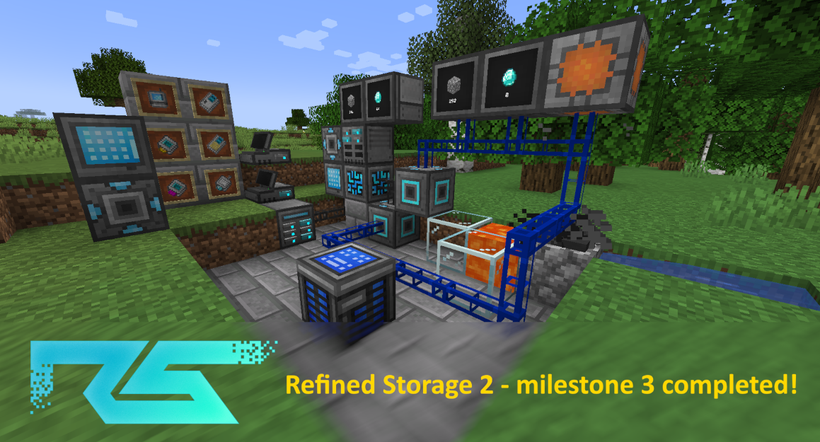
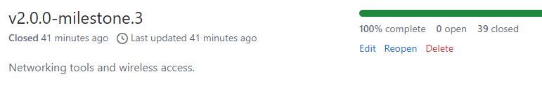

= Refined Storage 2 - milestone 3 completed!
:type: article
:description: Milestone 3 for Refined Storage 2 has been completed.
:date: 2024-06-28

Today, *milestone 3* for Refined Storage 2 has been completed!

link:https://github.com/refinedmods/refinedstorage2/wiki/FAQ[If you don't know what Refined Storage 2 is, please read the FAQ first.]

*Milestone 3 brings a lot of new features:*

* The mod got ported to Minecraft 1.20.4 and the NeoForge modloader.
** Support for Forge has been dropped.
* link:https://github.com/refinedmods/refinedstorage-curios-integration[Curios] and link:https://github.com/refinedmods/refinedstorage-trinkets-integration[Trinkets] integration mods have been created for the wireless items.
* link:https://github.com/refinedmods/refinedstorage-jei-integration[JEI] and link:https://github.com/refinedmods/refinedstorage-rei-integration[REI] integrations have been extracted into separate integration mods.
* link:https://github.com/refinedmods/refinedstorage-emi-integration[EMI] integration has been added.
* The Relay has been added with support for subnetworks.
** Watch a video about subnetworking in Refined Storage 2 link:https://www.youtube.com/watch?v=fRGH4ZUAnhQ[here].
* "Void excess" mode on the storages has been added.
** An old, loved, removed feature from Refined Storage 1.x, now re-added for Refined Storage 2.
* The Portable Grid has been added.
** Custom disk models have been added.
** Fluid disks have a different in-world model now.
* The Configuration Card has been added.
** A new item, copies configuration to other devices.
* Network Receiver / Network Transmitter / Network Card has been added.
* The Storage Monitor has been added.
* Wireless Grid / Wireless Transmitter / Range Upgrade has been added.
** Creative Range Upgrade has been added: infinite range upgrade (not craftable)
* The Security Card and Security Manager has been added.
** The security system has been slightly reworked and a Fallback Security Card has been added.
* The Disk Interface (formerly known as "Disk Manipulator") has been added.
* I've added Refined Storage 2 to link:https://crowdin.com/project/refined-storage-2[Crowdin] and integrated it with our code repository. Now everyone can contribute translations more easily!
* Thanks to all the early testers, link:https://github.com/refinedmods/refinedstorage2/issues?q=is%3Aissue+label%3Abug+is%3Aclosed+milestone%3Av2.0.0-milestone.3[a lot of bugs have been fixed].

Some statistics:

* Milestone 3 was in development from August 20th, 2023 to June 28th, 2024: about 10 months! _(milestone 2 was in development from June 22th, 2022 to August 19th, 2023, that is little over a year)_
* Milestone 3 had 39 closed issues _(milestone 2 had 63 closed issues)_
* Milestone 3 had 15 releases _(milestone 2 had 15 releases too)_

*What's next?*

link:https://github.com/refinedmods/refinedstorage2/milestone/3?closed=1[Now that milestone 3 is completed], I can focus on the last milestone, *milestone 4*!

link:https://github.com/refinedmods/refinedstorage2/milestone/4[Milestone 4 brings support for Minecraft 1.21, autocrafting and Mekanism chemical integration.]

After that, Refined Storage 2 will be ready and will replace Refined Storage 1.

*Want to try out Refined Storage 2 yourself?*

* link:https://github.com/refinedmods/refinedstorage2/releases/tag/v2.0.0-milestone.3.14[Find the latest version for milestone 3 here.]
* link:https://github.com/refinedmods/refinedstorage2/wiki/Getting-started[Find the getting started guide here.]
* link:https://discordapp.com/invite/VYzsydb[Join our Discord and let me know what your findings are!]
